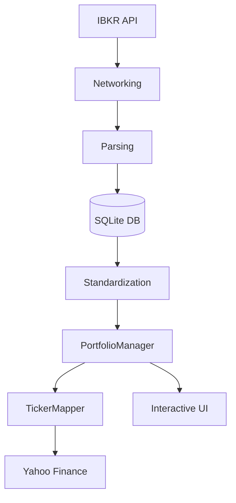

# Trade Journal & Risk Management System

A professional-grade portfolio management and risk analysis tool designed for Private Equity desks and family portfolios. This system uses a **ledger-based approach** to ensure mathematical integrity and provides a high-performance **Interactive Cockpit** for real-time monitoring.

## 🚀 Key Features

*   **Interactive Trading Cockpit**: A terminal-based dashboard with arrow-key navigation and dynamic position analysis.
*   **Ledger-Based Accounting**: Positions are computed on-the-fly by replaying transaction history, ensuring accuracy and auditability.
*   **Reset-on-Zero Logic**: Automatically wipes cost basis when a position quantity hits zero, allowing for clean re-entry tracking.
*   **Parallel Market Data**: High-speed updates using multi-threaded fetching from Yahoo Finance.
*   **Risk Engine**: Integrated ATR-based stop-loss (Fixed/Trailing) and take-profit targets.
*   **IBKR Integration**: Direct synchronization with Interactive Brokers Flex Web Service.
*   **Audit Trail**: Centralized logging system (`trade_journal.log`) for tracking all system actions and milestones.

## 🏗 Project Architecture

The application is built with a strictly modular "CEO Approach" to separation of concerns:



### Core Modules:
*   **`main.py`**: CLI Controller and entry point.
*   **`portfolio_manager.py`**: The central logic engine for position and risk calculation.
*   **`data_loader.py`**: Handles consistent data retrieval from DB and IBKR snapshots.
*   **`ibkr_parser.py`**: Interprets complex CSV/XML formats from brokers.
*   **`ticker_mapper.py`**: Reconciles IBKR symbols with Yahoo Finance (ISIN support).
*   **`models.py`**: Defines type-safe `Trade` and `Position` data structures.
*   **`logger.py`**: Manages system-wide logging and audit trails.

## 🛠 Setup & Installation

### Prerequisites:
*   Python 3.10+
*   [uv](https://github.com/astral-sh/uv) (Recommended for dependency management)

### Installation:
```bash
# Clone the repository
git clone <repo-url>
cd trade-journal

# Install dependencies
uv sync
```

### Configuration:
Create a `.env` file in the root directory:
```env
IBKR_TOKEN="YOUR_TOKEN"
IBKR_QUERY_ID_TRADES="TRADES_QUERY_ID"
IBKR_QUERY_ID_NAV="NAV_QUERY_ID"
IBKR_QUERY_ID_OPEN_POSITIONS="POSITIONS_QUERY_ID"
DATA_PATH="C:\Path\To\Your\OneDrive\TradeData"
```

## 📈 Usage

Run the application:
```bash
python main.py
```

### Dashboard Controls:
*   **UP/DOWN ARROWS**: Navigate through active positions.
*   **SIDE PANEL**: Displays deep-dive risk metrics (ATR, SL/TP Prices, Buffers) for the selected ticker.
*   **ESC**: Exit the cockpit and return to the main menu.

## 🧪 Testing
The project includes an automated test suite. Run tests using:
```bash
python -m unittest discover tests
```

## 📜 License
Private Equity proprietary tool. All rights reserved.
