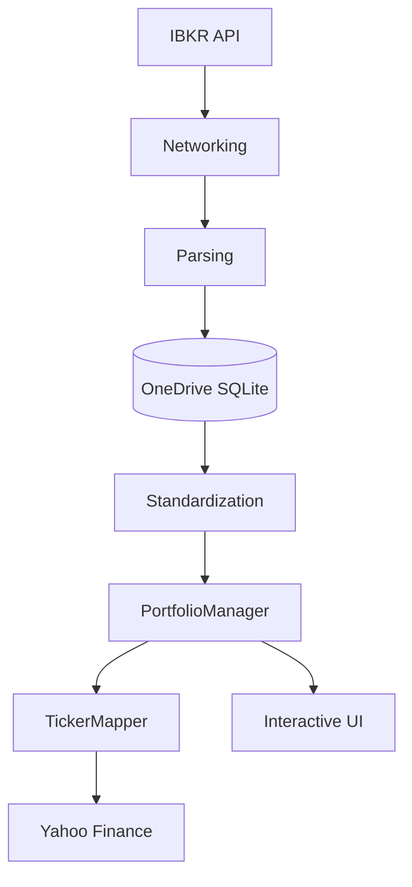

# Trade Journal & Risk Management System

A professional-grade portfolio management and risk analysis tool designed for Private Equity desks and family portfolios. This system uses a **ledger-based approach** to ensure mathematical integrity and provides a high-performance **Interactive Cockpit** for real-time monitoring.

## 🚀 Key Features

*   **Interactive Trading Cockpit**: A terminal-based dashboard with arrow-key navigation and dynamic position analysis.
*   **Ledger-Based Accounting**: Positions are computed on-the-fly by replaying transaction history, ensuring accuracy and auditability.
*   **Reset-on-Zero Logic**: Automatically wipes cost basis when a position quantity hits zero, allowing for clean re-entry tracking.
*   **Parallel Market Data**: High-speed updates using multi-threaded fetching from Yahoo Finance.
*   **Risk Engine**: Integrated ATR-based stop-loss (Fixed/Trailing) and take-profit targets.
*   **IBKR Integration**: Direct synchronization with Interactive Brokers Flex Web Service.
*   **Audit Trail**: Centralized logging system (`trade_journal.log`) for tracking all system actions and milestones.

## 🏗 Project Architecture

The application is built with a strictly modular "CEO Approach" to separation of concerns, utilizing a three-tier storage structure:

1.  **Code Repository (Local/GitHub)**: `C:\repos\trade-journal`
    *   Pure logic and documentation. No secrets or personal data.
2.  **Configuration Vault (OneDrive Metadata)**: `...\Documents\Logos\.repos\trade-journal`
    *   **`.env`**: Private API keys and IBKR tokens.
    *   **`GEMINI.md`**: Project-specific rules and persistent context.
3.  **Storage Hub (OneDrive Data)**: `...\Accounts\HTC_EOOD\TradeJournalData`
    *   **`trade_journal.db`**: SQLite database for manual trades and risk settings.
    *   **`trade_journal.log`**: Audit trail of all system operations.



## 🛠 Setup & Installation

### Prerequisites:
*   Python 3.10+
*   [uv](https://github.com/astral-sh/uv) (Recommended for dependency management)

### Installation:
```bash
# Clone the repository
git clone <repo-url>
cd trade-journal

# Install dependencies
uv sync
```

### Secure Configuration:
Secrets are managed in the **Configuration Vault** on OneDrive to prevent leaks to GitHub.
The system automatically loads credentials from:
`C:\Users\User\OneDrive\Documents\Logos\.repos\trade-journal\.env`

## 📈 Usage

Run the application:
```bash
python main.py
```

### Dashboard Controls:
*   **UP/DOWN ARROWS**: Navigate through active positions.
*   **SIDE PANEL**: Displays deep-dive risk metrics (ATR, SL/TP Prices, Buffers) for the selected ticker.
*   **ESC**: Exit the cockpit and return to the main menu.

## 🧪 Testing
The project includes an automated test suite. Run tests using:
```bash
python -m unittest discover tests
```

## 📜 License
Private Equity proprietary tool. All rights reserved.


# Scratchpad

1. When pulling from Interactive Brokers, I will pull a few different files:
   - trades.csv
   - open_positions.csv
   - nav.csv
   - corporate_actions.csv
2. Probably keep .env and gemini.md in the standard folder. However, everytime I run the application make a back up in the onedrive. Maybe that's the cleanest way. 
3. Stock split capability of .db. Maybe add a new table in the DB which holds historical instrument information that should be pulled from other queries. Although I can't think of anything else, other than - date and ratio of stock split. 
4. Naming convention of query. [name]_[period].csv
   - year - 2024, 2025, etc.
   - ytd - current year to date
   - lbd - last business day
5. Transfers. Search for files named transfers_[year/ytd].csv. Filter Type/INTERCOMPANY and populate the database. First, check if there is enough information to populate the database and let me know.
6. Corporate_actions_ytd.csv - go over those and make sure that you get all the stock splits.
7. How the script works. Pulls information for the .csv files transfers, trades, and corporate actions and file it into the database. Then use the open_positions_lbd to get the instruments that you need and use this list to calculate and populate the dashboard. Use nav_lbd to get the real NAV from the last business day. Please confirm if this is how the script works. Basically the data related to historical period is located in data_base and the last business day data is in folder last_business_day. Can you please check if this is what the script does and outline any point that it is not doing and needs to be addressed. Make a plan on how to fix it and ask me if I want to fix it.
8. .env and gemini.md are backed up in onedrive everytime I exit the application. whenever the application starts, it should check if it works with the latest versions and if not, copy them from the onedrive location.

## GEMINI Skills
Think of Gemini Skills as "specialized apps" or "procedural memory" that you
  install into my system. While I am generally smart about coding, a Skill gives
  me specific instructions on how you want things done in this specific project.

  Here is the breakdown of how they work:


  1. The "Three-Layer" Logic (Context Efficiency)
  The most important thing about Skills is that they don't clog up my "brain"
  (context window) until they are needed.
   * Layer 1 (Metadata): I always keep a tiny list of all installed Skills and
     their descriptions. If you say "wrap up," I look at that list, see that the
     session-logger matches that request, and I "activate" it.
   * Layer 2 (The Instructions): Once activated, I read the SKILL.md file. This
     tells me exactly what steps to take (e.g., "Check git diff," "Create a log
     file," "Update GEMINI.md").
   * Layer 3 (Bundled Resources): If the skill has complex scripts or templates
     (like a specific Excel reporter or a PE dashboard template), I only grab
     those when the instructions tell me to.


  2. Scopes: Global vs. Workspace
   * User Scope (Global): These are skills available in every project you open.
     (e.g., a "Personal Fact Rememberer" or a "Standard PE Email Formatter").
   * Workspace Scope (Project): These are specific to the current folder. The
     session-logger we just made is a Workspace Skill. It lives inside your
     trade-journal repo because the logic for updating GEMINI.md is specific to
     this project.


  3. The Lifecycle of a Skill
   1. Trigger: You give a command or ask for a task that matches a skill's
      description.
   2. Activation: I "load" the skill's instructions.
   3. Execution: I follow the "Core Mandate" of the skill. In our case, the
      mandate is: Maintain PE-grade auditability through documentation.
   4. Completion: Once the task is done, the skill goes back into the "app
      drawer."


  4. How YOU manage them
  You have a few special slash-commands in the CLI to manage these:
   * /skills list: Shows you everything currently installed.
   * /skills reload: Essential when you (or I) modify a skill. It forces me to
     re-read the definitions.
   * /skills info <name>: Shows the detailed instructions for a specific skill.


  Why this matters for your Trading Desk
  For a Private Equity professional, this is about standardization. By using
  Skills, you ensure that no matter when we work together—whether it's today or
  six months from now—the documentation will always have the same structure, the
  ledger will always be rebuilt using the same logic, and the "Single Source of
  Truth" will never drift. 

  ## Outstanding points
  1. Create a Watch List. Put stocks there that you think are undervalued or battered. Then start monitoring for a good entry point. This is where the Confluence Zone Discovery Method should come in.
  2. Confluence Zone Discovery:
     1. Discover your ATR and this is where you should start searching for an entry price
     2. Look for confluence of that price with EMAs, Bollinger Bands, Fibonacci, etc.
  3. Analyze volumes to discover bear and bull markets. Bull market volumes rise with the price, bear markets volums move oposite direction. Only with other markers though.
  4. ticker_info table in the db: bond multipliers should be x0.001; ISIN info should be taken from the trade tables, where you also take stock exchange, etc.
  5. Risk Workspace: Assess the de-risking of the position. Start with initial risk for the position and the path of de-risking it through dividends, selling covered calls and moving the Stop Loss with the price. IMPORTANT!
  6. Definitions is very important. I need to figure out where to hold them and update them. Maybe directly in the code, or from the UI. Need to assess.

✦ When you arrive at the office, you should run these three commands to ensure your office machine is
  perfectly in sync with the work we just finished:

   1. Switch to the main branch (if you aren't already there):
      git checkout main

   2. Pull the latest updates:
      git pull origin main

   3. Verify the sync:
      git log -n 1
      (You should see the commit: "merge: incorporate thread-safe dashboard updates...")


  Why this is important:
  This will bring all the thread-safety fixes, the 60-second refresh logic, and the Asset Master
  database migration to your office machine. From that point forward, you can do all your work directly
  on `main` to avoid the branch confusion we encountered today.

  If you have any uncommitted changes at the office that you want to keep, you can run git stash before 
  pulling, and git stash pop after pulling. Otherwise, the steps above will get you up to speed!


  ## Important pieces of chat
  #### Target Quantity shares
  I have implemented the full financial target tracking for both strategies.
  The Asset Context panel now provides a detailed breakdown of your capital
  requirements.


  1. For Scale-In Strategies (S flag)
  The system now calculates the Scale-In Target Outlay by summing the cost
  of all three tranches at their respective roadmap prices:
   * Tranche 1: Inception Price * 1/3 Target
   * Tranche 2: Stage 2 Price * 1/3 Target
   * Tranche 3: Stage 3 Price * 1/3 Target


  2. For Single Purchase Strategies
  The system calculates the Full Target Outlay based on the capital required
  to reach a 1% NAV risk unit at the current market price.


  3. Universal "Remaining Capital" Tracking
  Regardless of the strategy, the panel now displays:
   * Current Holding: Your actual shares and their average cost.
   * Target Outlay: The total cash needed for a full institutional unit
     (sized for 1% risk).
   * Remaining Cap: The specific amount of cash still needed to "complete"
     the position.

  Example Roadmap:


   1 POSITION ROADMAP: [STAGE 1/3 ACTIVE]
   2   - Current:   150 sh (@ 293.60)
   3   - Stage 2 @: 335.09 (Add +110 sh)
   4   - Stage 3 @: 358.58 (Add +130 sh)
   5   - Target Outlay: 135,402 USD
   6   - Remaining Cap: 91,362 USD
   7   - Pilot Stop: 264.64 (assigned ATR)


  You can now see exactly how much capital is required to fulfill your risk
  plan for every asset!

  ---------------------------

  I have updated the Target Quantity calculation to respect both of your
  institutional hard limits.


  The full_target_qty is now dynamically calculated as the minimum of:
   1. Risk Limit (1.0%): Total shares allowed based on the distance from
      entry to stop.
   2. Exposure Limit (5.0%): Total shares allowed based on current market
      price as a percentage of NAV.


  What this means for the Roadmap:
   * Safety First: If an asset is highly volatile (wide ATR), the Risk Limit
     will restrict the quantity.
   * Concentration Control: If an asset is low volatility (tight ATR), the
     Exposure Limit will step in to prevent you from owning more than 5.0%
     of your NAV in a single ticker.
   * Outlay & Remaining Cap: These financial figures now reflect the
     "Dual-Constraint" reality. They show the capital needed to reach the
     smaller of the two targets, ensuring you don't over-allocate capital
     beyond your exposure ceiling.


  You can see this in action in the Asset Context & Risk Audit panel. If the
  Exposure limit is the bottleneck, you will notice the "Full Target"
  quantity is capped at exactly 5% of your total NAV.

#### ATR, Stop, Scale-In, Increments

    1. Manual Override (Absolute Control)
  You can now add a 4th parameter to your Strategy Lab command to dictate the exact
  scale step.
   * 49.5 T S 0.5 -> Trailing Stop, Scale-In, 0.5x increments.
   * 14.5 T S 1.0 -> Trailing Stop, Scale-In, 1.0x increments.
   * 10% T S 0.75 -> Trailing Stop, Scale-In, 0.75x increments.


  2. The "Smart Default" (If you forget to type the step)
  If you simply type 49.5 T S (omitting the step size), the system automatically
  analyzes the "width" of your ATR to deduce your timeframe:
   * It calculates your assigned ATR as a percentage of the current stock price.
   * Macro Trend ( > 15% of Price): If your ATR is massive (like an 8q window), the
     system automatically sets the scale step to 0.5x.
   * Micro Trend ( <= 15% of Price): If your ATR is small (like a 14d window), the
     system automatically sets the scale step to 1.0x to prevent you from getting
     whipsawed by daily noise.