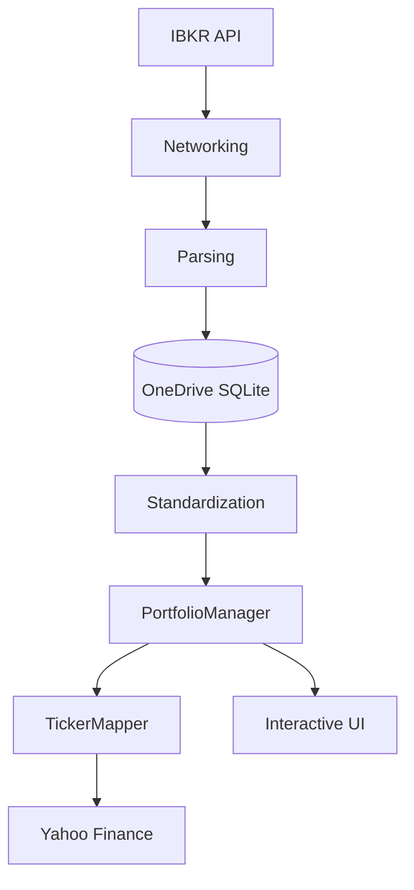

# Trade Journal & Risk Management System

A professional-grade portfolio management and risk analysis tool designed for Private Equity desks and family portfolios. This system uses a **ledger-based approach** to ensure mathematical integrity and provides a high-performance **Interactive Cockpit** for real-time monitoring.

## 🚀 Key Features

*   **Interactive Trading Cockpit**: A terminal-based dashboard with arrow-key navigation and dynamic position analysis.
*   **Ledger-Based Accounting**: Positions are computed on-the-fly by replaying transaction history, ensuring accuracy and auditability.
*   **Reset-on-Zero Logic**: Automatically wipes cost basis when a position quantity hits zero, allowing for clean re-entry tracking.
*   **Parallel Market Data**: High-speed updates using multi-threaded fetching from Yahoo Finance.
*   **Risk Engine**: Integrated ATR-based stop-loss (Fixed/Trailing) and take-profit targets.
*   **IBKR Integration**: Direct synchronization with Interactive Brokers Flex Web Service.
*   **Audit Trail**: Centralized logging system (`trade_journal.log`) for tracking all system actions and milestones.

## 🏗 Project Architecture

The application is built with a strictly modular "CEO Approach" to separation of concerns, utilizing a three-tier storage structure:

1.  **Code Repository (Local/GitHub)**: `C:\repos\trade-journal`
    *   Pure logic and documentation. No secrets or personal data.
2.  **Configuration Vault (OneDrive Metadata)**: Managed via `CONFIG_VAULT` in `.env`.
    *   **`.env`**: Private API keys and IBKR tokens.
    *   **`GEMINI.md`**: Project-specific rules and persistent context.
3.  **Storage Hub (OneDrive Data)**: Managed via `DATA_PATH` in `.env`.
    *   **`trade_journal.db`**: SQLite database for manual trades and risk settings.
    *   **`trade_journal.log`**: Audit trail of all system operations.



## 🛠 Setup & Installation

### Prerequisites:
*   Python 3.10+
*   [uv](https://github.com/astral-sh/uv) (Recommended for dependency management)

### Installation:
```bash
# Clone the repository
git clone <repo-url>
cd trade-journal

# Install dependencies
uv sync
```

### Secure Configuration:
Secrets are managed in the **Configuration Vault** on OneDrive to prevent leaks to GitHub.
The system automatically loads credentials from:
`C:\Users\User\OneDrive\Documents\Logos\.repos\trade-journal\.env`

## 📈 Usage

Run the application:
```bash
python main.py
```

### Dashboard Controls:
*   **UP/DOWN ARROWS**: Navigate through active positions.
*   **SIDE PANEL**: Displays deep-dive risk metrics (ATR, SL/TP Prices, Buffers) for the selected ticker.
*   **ESC**: Exit the cockpit and return to the main menu.

## 🧪 Testing
The project includes an automated test suite. Run tests using:
```bash
python -m unittest discover tests
```

## 📜 License
Private Equity proprietary tool. All rights reserved.


# Scratchpad

1. When pulling from Interactive Brokers, I will pull a few different files:
   - trades.csv
   - open_positions.csv
   - nav.csv
   - corporate_actions.csv
2. [x] Probably keep .env and gemini.md in the standard folder. However, everytime I exit the the application make a back up in the onedrive, just as the logger function runs upon start of the application. Maybe that's the cleanest way. What do you think?
3. Stock split capability of .db. Maybe add a new table in the DB which holds historical instrument information that should be pulled from other queries. Although I can't think of anything else, other than - date and ratio of stock split. 
4. [x] Naming convention of query. [name]_[period].csv
   - year - 2024, 2025, etc.
   - ytd - current year to date
   - lbd - last business day
5. Bonds and Options are shown with the wrong multiplier. You probably need to include it in the calculation for the dashboard.